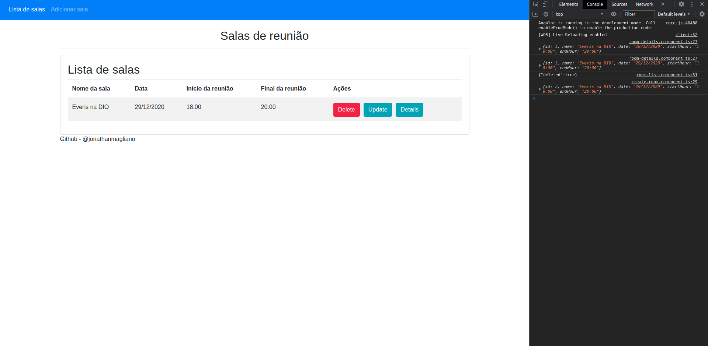

# API - Meeting Room
* Foi desenvolvido uma API com Spring Boot para gerenciar determinada lista de salas de reunião e utilizou-se o Spring Data para persistência de dados e o banco in-memory H2; tal back-end com o auxílio dos conceitos da linguagem Java. E o front-end do projeto consistiu no consumo de uma API considerando a execução SPA (Single-page-application) escrita em Angular.

Material de apoio:

* [SDKMAN! para gerenciamento e instalação do Java e Maven](https://sdkman.io/)
* [Site oficial do Spring](https://spring.io/)
* [Site oficial do Spring Initializr para setup do projeto](https://start.spring.io/)
* [Referência para o padrão arquitetural REST](https://restfulapi.net/)
* [Angular](https://material.angular.io)
* [Postman - API Development](https://www.postman.com/)
